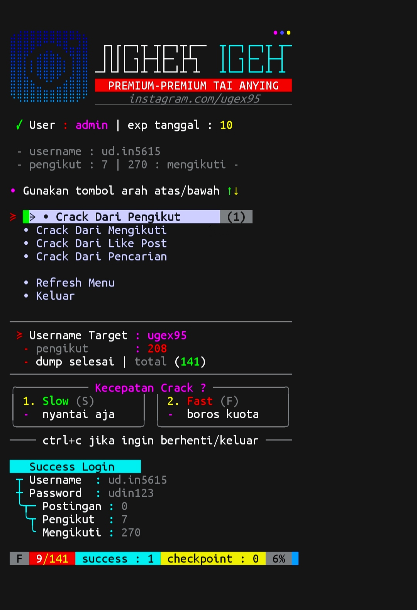
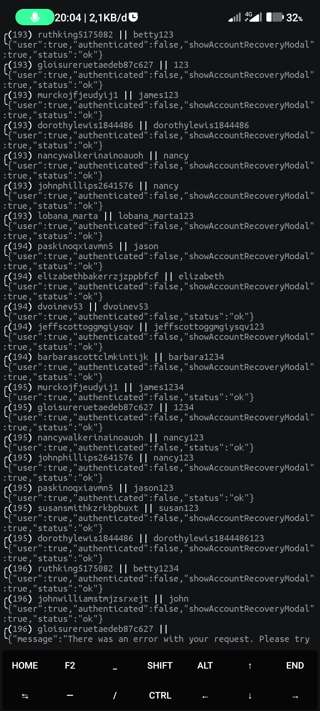

# NGHEK IGEH<br><br>
### ❯ Menu
<br><br>
## ❯ Instalasi
Salin semuanya paste di termux terus enter!!!
```bash
apt update;apt upgrade
apt-get install python -y
apt-get install git -y
git clone https://github.com/Din-zUgex95/nghek-igeh
cd nghek-igeh
pip install -r requirements.txt
chmod 777 run
./run
```
<br><br>
## ❯ pengaturan
 Buka file [config.json](.data/config.json)
```json
{
    "settings": [
        {
            "max_dump_id": 3000,
            "max_work": 15,
            "default_crack_speed": "fast"
        }
    ]

}
```
<br><br>
### ❯ Logging
<br><br>
<br><br>
## ❯ catatan
 Baca file [note.txt](note.txt) terlebih dahulu
<br><br><br><br>
